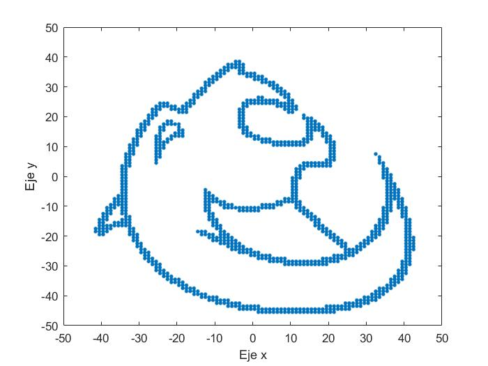
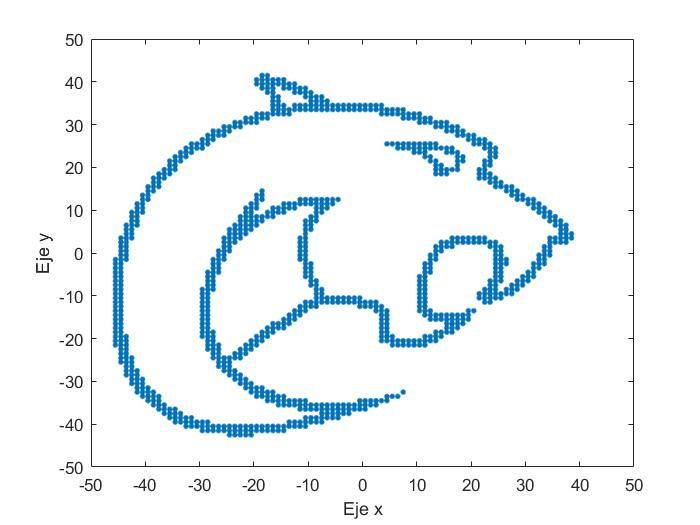
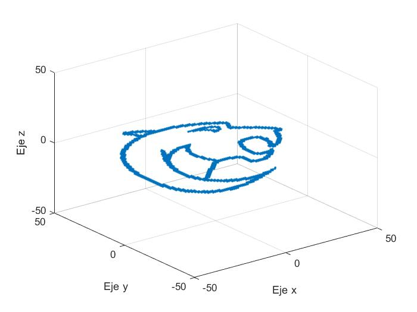

<!-- # matlab_basic
Curso de matlab KON

```Matlab
%% Ejercicio 1

x1 = 5*4 + 7^2 % a)
x2 = (8/3 + 0.45^3)*4 % b)
x3 = 25 - (3*4 + 2^x2)/2 %c)

%% Ejercicio 2

y1 = [1, 2, 3, 4, 5];
y2 = [1; 2; 3; 4; 5];
y3 = 0: 0.05: 0.2;
y4 = [1, 2, 3, 4, 5; 6,7,8,9,10];

%% Ejercicio 3

v1 = y3.*y1; % a)
% v2 = y3 * y1 % Error por tamaño de matrices
v3 = y4 *y2; % c)
v4 = y1.^2; % d)
v5 = y1(1:3); % e)
v6 = y1(1:2:5); % f)
``` -->

# MATLAB Basic (Day 1)

En la clase de hoy se tocarán los temas de vectores, representación de posición de un cuerpo rígido, matrices, la orientación de un cuerpo rígido, operaciones con matrices y su aplicación a la composición de rotaciones.

Al finalizar la clase, en MATLAB, entren a esta carpeta y abran el archivo `day1_challenge.m`

El objetivo de este reto es el de rotar una imagen del logo KON armada con puntos para que tenga la orientación correcta.

Figura 1:



Figura 2:



También se busca que se exploren rotaciones en otros ejes y pueda trabajarse los puntos en 3D.

Figura 3:


