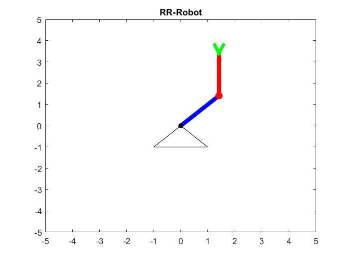
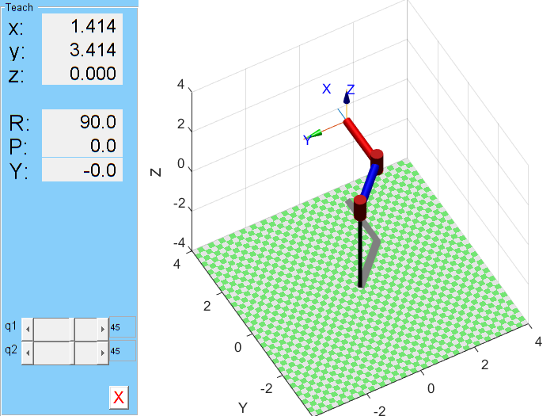

# Cinemática directa de un robot R-R

En esta actividad se busca aprender como hacer una simulación en MATLAB de un robot de 2 grados de libertad.

Para ello abrir el archivo `rr_robot.m`, donde podremos definir los parámetros de nuestro robot y la función para graficarlo. Se utiliza el método geométrico para conocer la posición del efector final.

Se utiliza el método geométrico para determinar las posiciones finales y la visualización del robot para verificarlo.

Por ejemplo, la siguiente imagen muestra la configuración $q = [45, 45]$



Además podremos realizar una simulación de la cinemática para distintos valores de $q$


## Utilizando el [```Robotics toolbox```](https://petercorke.com/toolboxes/robotics-toolbox/) en matlab

Podemos simplificar la simulación y no tener que realizar todo el desarrollo de la visualización utilizando toolboxes de matlab como el ```Robotics toolbox```. 

Una vez instalado, ejecutamos la sección del script que lo utiliza y veremos lo siguiente.



Podemos ajustar en este caso los valores de los ángulos y obtener distitnas configuraciones. Esta simulación además es en 3D, por lo que les permite simular un robot más realista de acuerdo a como lo configuren. El archivo `robotics_toolbox_guide.pdf` incluye la documentación para la programación y que se puedan configurar sus propios robots.


Este toolbox es mucho más apropiado si se desea realizar simulaciones más realistas no solo en el ámbito cinemático y tiene varios ejemplos que podemos realizar. Para ejecutar estos demos, ejecutamos en la consola

```
rtbdemo
```

y podremos explorar los distintos ejemplos que tiene para nosotros. 


