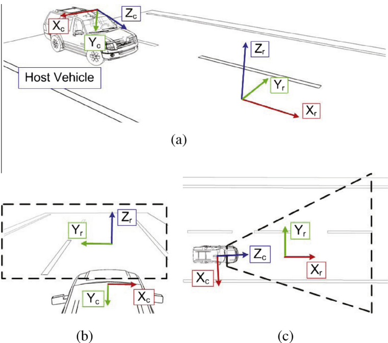
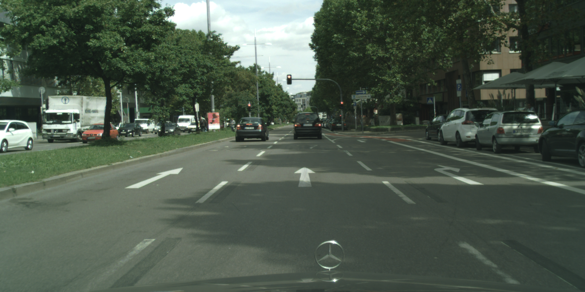
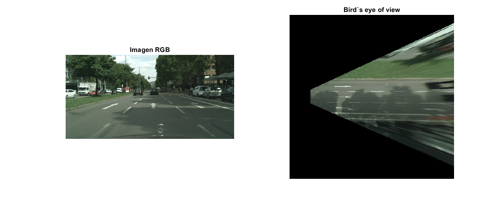

# Mapeo proyectivo inverso


## Introducción
El mapeo proyectivo inverso (IPM - *Inverse Projective Mapping*) consiste en producir una imagen de vista de pájara (*bird's eye of view*) del entorno a partir de solo una imagen frontal. Este concepto es aplicado en el área de vehículos autónomos con el objetivo de detectar líneas de carril, planificación de trayectorias, predicción de intersecciones, etc. Un ejemplo de ello se puede encontrar en el siguiente [paper](https://ieeexplore.ieee.org/abstract/document/7408003).


El procedimiento consite básicamente en mapear todos los pixeles de un punto de vista determinado por un plano mediante un proyección homográfica (Figura 1). Dicha proyección es, en términos sencillos, una matriz de transformación; por lo que la idea central de este concepto se reduce a una multiplicación adecuada de matrices. No obstante, es importante tener en claro algunos conceptos y restricciones importantes.

<p align="center">
  
     
Figura 1: (a) Una escena típica de carretera con una cámara montada en el vehículo mirando hacia la carretera. El sistema de referencia de la cámara está etiquetado como {$X_cY_cZ_c$} y el de la carretera como {$X_rY_rZ_r$}. (b) Ejemplo de imagen captada por la cámara. Esta imagen se utiliza como entrada para el IPM. (c) Imagen de salida del IPM. Recuperado de [[1]](https://www.sciencedirect.com/science/article/abs/pii/S1566253514001031).
</p>


Consideraciones:
- Generalmente, IPM funciona de manera adecuada en el entorno cercano a la cámara. Cuando los objetos se encuentran alejados suelen ocurrir efectos de desenfoque y estiramiento de la escena. Estos efectos se acentúan durante el mapeo proyectivo, pues existe un menor número de píxeles que limitan la aplicación de IPM.
- La imagen debe ser capturada por una cámara ubicada en una posición fija, debido a que cualquier perturbación afectará en la proyección de la imagen.
- El plano a proyectar debe contener superficies planas, puesto que los objetos "con altura" crearán distorsiones en la imagen proyetada.


## Implementacion

A continuación, se muestra el procedimiento detallado para generar la BEV a partir de una imagen frontal RGB. Es importante mencionar que en este taller el objetivo es mostrar el uso del álgebra lineal en aplicaciones de robótica y *computer vision* (CV), por lo que no entraremos en detalle de otros conceptos de CV, solo lo suficiente para comprender la aplicación en cuestión.

### Lectura de una imagen RGB

Se utiliza el comando `imshow()` para visualizar la imagen RGB.
```matlab
%% Visualizar imagen rgb
imageRGB = imread('./images/frontImage.png');
figure,
subplot(121),
imshow(imageRGB);
title('Imagen RGB');
```

<p align="center">
  

  La imagen de prueba fue recuperada de [[2]]((https://daryl-tan.medium.com/). )
</p>

### Selección del plano a proyectar
En primer lugar se selecciona la región de la carretera que queremos ver en el plano BEV. Generalmente, para ello se debe definir la resolución en píxeles, la distancia absoluta por píxel (escala) y la pose (posición y orientación). No obstante, en este caso solo es necesario definir la posición, la resolución y la escala. 

```matlab
%% Definir plano de accion
TARGET_H= 500; TARGET_W = 500;
planoXYZ = plane(0, -25, TARGET_H, TARGET_W, 0.1);
planoXYZ(2,:) = -planoXYZ(2,:);
```
Donde `plane()` es una función que genera una malla con las coordenadas del plano a partir de los límites extremos del plano definido. 
```matlab
function mesh = plane(x, y, col, row, scale)

% Establecer limites del plano
xMin = x;
xMax = x + col*scale;
yMin = y;
yMax = y + row*scale;

% Generar meshgrid a partir de los limitess
mesh = genMeshgrid(xMin, xMax, col, yMin, yMax, row);

end

function coords = genMeshgrid(xMin, xMax, numX, yMin, yMax, numY)

% Generar mesh grid
x = linspace(xMin, xMax, numX);
y = linspace(yMin, yMax, numY);
[x, y] = meshgrid(x, y);

% Reordenar las matrices como filas
x = reshape(x.', 1, []);
y = reshape(y.', 1, []);
z = zeros(size(x));

% matriz homogenea
coords = [x; y; z; ones(size(x))];

end
```

### Parámetros de la cámara
Como se vio en la aplicación anterior, en las aplicaciones de *Computer Vision* es necesario conocer los parámetros intrínsecos y extrínsecos de la cámara con la cual se tomaron las fotos. En este caso también se brindarán ambos parámetros como datos de la aplicación.

```matlab
%% Parametros de la camara
K = [2263.55, 0, 1079.02,  0;
     0, 2250.37,  515.01,  0;
     0,       0,       1,  0;
     0,       0,       0,  1];
 
Rt = [-0.0097, -0.9999,       0,  0.0427;
      -0.0384,  0.0004, -0.9993,  1.2768;
       0.9992, -0.0097, -0.0384, -1.6518;
            0,       0,       0,       1];
```

### Aplicar el mapeo proyectivo
A continuación, se calcula las coordenadas de los pixeles y posteriormente se realiza el mapeo proyectivo.
```matlab
P = K*Rt;
pixelCoords = perspective(planoXYZ, P, TARGET_H, TARGET_W);
```
Dicho mapeo es realizadpo por la función `perspective()`, la cual se detalla a continuación:
```matlab
function pixelCoords = perspective(camCoords, projMat, h, w)

eps = 1e-7; % Parametro para evitar la division por 0 en la division

% Implementacion de ecuacion de modelo de la camara
pixelCoords = projMat*camCoords;
% Homogenizar coordenadas
pixelCoords = pixelCoords(1:2, :)./(pixelCoords(3,:)+eps);

% Reordenar coordenadas
pixelCoords = reshape(pixelCoords, 2, h, w);
pixelCoords = permute(pixelCoords, [2, 3, 1]);

end
```

### Interpolador bilineal
Con el objetivo de evitar efectos de aliasing o deformaciones en la imagen se implementa un interpolador bilineal. Básicamente este interpolador calcula el valor dee un pixel tomando el promedio ponderado de sus 4 píxeles vecinos. La implementación de dicho interpolador se encuentra en la función `bilinearSampler()`.


Para mayor detalle puede leer el siguiente [paper](https://www.researchgate.net/publication/341671113_Prediction_of_Depth_Maps_using_Semi-Supervised_Learning), específicamente la sección de *Bilinear sampler
*.

## Resultado

<p align="center">
  
     
Figura 2: En la izquierda se observa la imagen RGB frontal, mientras que en la derecha se observa la imagen BOV resultante. Como se observa, en los extremos ms alejados de la imagen y los ojetos con "altura", como los árboles, presentan distorsiones.
</p>
