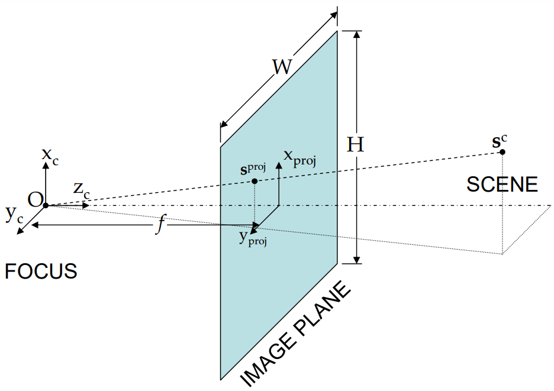
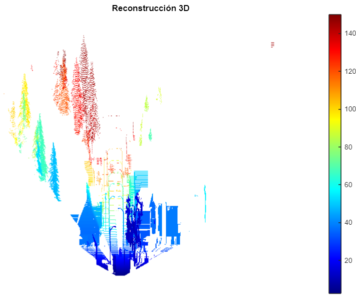
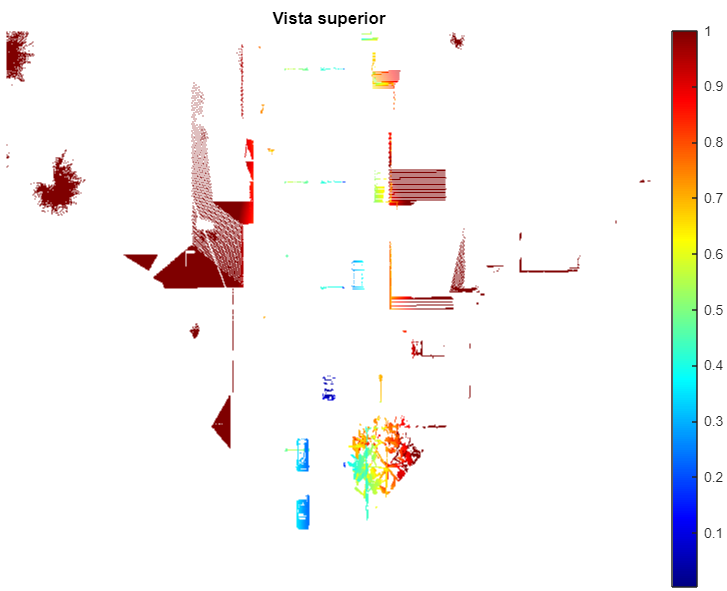

# Transformación proyectiva inversa (Parte 1)

## Introduction

La transformación proyectiva expresa la relación que existe entre dos sistemas de coordenadas distintos; es decir, la transformación que es necesario aplicar a uno de los sistemas para obtener el otro.

Una aplicación de este concepto se encuentra en la tecnología desarrollada en los vehículos autónomos, y *Computer Vision* en general. Por ejemplo, cuando la cámara de un vehículo captura su entorno, entonces los objetos tridimensionales (coordenadas del entorno) son mapeados a una imagen bidimensional (coordenadas de la imagen de la cámara), tal y como se muestra en la Figura 1. Como resultado de ello, se pierde la información de la profundidad. Es decir, no se puede conocer a qué distancia se encuentra cada objeto.


<div style="text-align:center">

Figura 1: Modelo de proyección de una cámara [1]. Un punto tridimensional en el entorno es ubicado virtualmente en el plano de la imagen generado por la cámara.
</div>
  
Ahora, ¿Es posible realizar el proceso inverso? Esto es, reconstruir el entorno del vehículo utilizando la imagen bidimensional. La respuesta corta es sí, pero también es necesario tener disponible la información de la profundidad. Generalmente, tanto la imagen 2D como la profundidad se sensa mediante una cámara de profundidad (RGB-D) como la RealSense [[link](https://www.amazon.ca/Intel-RealSense-Depth-Camera-D435i/dp/B07MWR2YJB/ref=asc_df_B07MWR2YJB/?tag=googleshopc0c-20&linkCode=df0&hvadid=335055404543&hvpos=&hvnetw=g&hvrand=15623794657013069629&hvpone=&hvptwo=&hvqmt=&hvdev=c&hvdvcmdl=&hvlocint=&hvlocphy=9001382&hvtargid=pla-665733477051&psc=1)]. Para lograr realizar dicho proceso, es necesario conocer los paramétros intrínsecos de la cámara, una imagen RGB, la información de profundidad y encontrar la transformación entre ambos sistemas de coordenadas. A continuación, se muestra el procedimiento utilizando MATLAB.

## Parámetros de una cámara

En *Computer vision*, uno de los pasos más importantes es el de la calibración de la cámara con la cual se capturan las imágenes. Este proceso consiste en determinar los parámetros intrínsecos, extrínsicos ($[R|t]$) y de distorsión de la cámara. 

Por un lado, la matriz de parámetros intrínsicos ($K$) contiene información de la distancia focal ($f_x$, $f_y$), el centro óptico de la cámara  ($u_0$, $v_0$), y el factor de desviación ($\gamma$, considerado, por simplicidad, como 0). Por otro lado, la matriz de parámetros extrínsecos ($[R|t]$) describen la transformación relativa del sistema de coordenadas del entorno al de la cámara.

*Nota: La presenta aplicación **no** se centra proceso de calibración de una cámara, por lo que se proporcionan directamente la matriz de calibración. Para mayor información de cómo realizar la calibración vea la siguiente [referencia](https://www.mathworks.com/help/vision/ug/)*


## Modelo de proyectividad de una cámara

Este modelamiento describe las matemáticas de la transformación de un punto del entorno a un punto de la imagen. Matemáticamente, esta relación se expresa como $(u,v) = f(X, Y, Z)$, o de forma más específica como:
$$p = K [R|t]P$$

$$
\begin{equation}
s\begin{bmatrix}u\\
                  v\\
                  Z
    \end{bmatrix}= \begin{bmatrix}f_x & \gamma & u_0\\
                                  0 & f_y & v_0\\
                                  0 & 0 & 1 \end{bmatrix}
                  \begin{bmatrix}r_{11} & r_{12} & r_{13} & t_{1}\\
                    r_{21} & r_{22} & r_{23} & t_{2}\\
                    r_{31} & r_{32} & r_{33} & t_{3}\\\end{bmatrix}
                    \begin{bmatrix}X\\
                                   Y\\
                                  Z \\ 1\end{bmatrix}
\end{equation}$$

Donde:
- *p ([u, v, Z])* es la posición de un punto en el sistema de coordenadas de la cámara. Cabe mencionar que estas coordenadas no son homogéneas, por lo que también se expresan como $[x, y, 1]^TZ$.
- $P ([X, Y, Z, 1])$ es la representación 3D de un punto del entorno en el sistema de coordenadas del entorno.
- $s$ es el factor de escala, el cual controla como se escalan los píxeles en las direcciones $x$ e $y$ al cambiar la distancia focal.

Recordemos que nuestro objetivo es poder reconstruir el entorno, por lo que es necesario encontrar los puntos $[X, Y, Z]$. Además, consideremos un factor de escalamiento igual a 1. asimismo, definamos que visualizaremos el entorno desde un sistema de coordenadas ubicado en la cámara. Esto significa que la matriz de rotación ($R$) es igual a la matriz identidad y que el vector de traslación es un vector de ceros. Por ende, la ecuación queda como sigue:
$$
\begin{bmatrix}
x\\ y\\1 
\end{bmatrix}Z=K\begin{bmatrix}
1 & 0 & 0 & 0\\ 0 & 1 & 0 & 0\\ 0 & 0 & 1 & 0\\ 
\end{bmatrix}\begin{bmatrix}
X\\ Y\\Z \\1 
\end{bmatrix}
$$
Note que $Z$ es un escalar, por lo que no es una multiplicación matricial. Por lo tanto, podemos multiplicar por la inversa de la matriz de calibración en cada lado:
$$
K^{-1}\begin{bmatrix}
x\\ y\\1 
\end{bmatrix}Z = \begin{bmatrix}
1 & 0 & 0 & 0\\ 0 & 1 & 0 & 0\\ 0 & 0 & 1 & 0\\ 
\end{bmatrix}\begin{bmatrix}
X\\ Y\\Z \\1 
\end{bmatrix}\\
$$  
Realizamos la multiplicación matricial en el lado derecho de la ecuación y obtenemos:
$$
K^{-1}\begin{bmatrix}
x\\ y\\ 1 
\end{bmatrix}Z = \begin{bmatrix}
X\\ Y\\ Z
\end{bmatrix}
$$
Finalmente, despejamos y se obtiene:
$$
\begin{bmatrix}
X\\ Y\\ Z
\end{bmatrix} = K^{-1}\begin{bmatrix}
x\\ y\\1 
\end{bmatrix}Z
$$

*Nota: La presenta aplicación se centra en la implementación de las ecuaciones dadas. Para tener más detalles de cómo se obtiene la ecuación (1), revise el siguiente [blog](https://www.imatest.com/support/docs/pre-5-2/geometric-calibration-deprecated/projective-camera/#:~:text=A%20projective%20camera%20model%20describes,most%20cameras%20in%20this%20method*).*

## Código

Las imágenes a utilizar fueron obtenidas del software CARLA, un simulador de vehículos utilizado ampliamente para el desarrollo de algoritmos en vehículos autónomos, las cuales fueron recuperadas del siguiente [blog](https://daryl-tan.medium.com/). 

A continuación, se muestra el paso a paso del código elaborado

### Lectura de una imagen RGB

Se utiliza el comando `imshow()` para visualizar la imagen RGB.
```matlab
%% Visualizar imagen rgb
imageRGB = imread('./images/imageRGB.png');
figure,
subplot(121),
imshow(imageRGB);
title('Imagen RGB');
```
## Lectura de una imagen de profundiad

Generalmente la profundidad se suele representar como una imagen bidimensional, en el que la intensidad define qué tan lejos se encuentra el punto en el entorno. En este caso se utiliza el comando `exrread()` para leer el archivo que contiene la información de profundidad y luego el comando `imshow()` para visualizar la imagen. 

```matlab
%% Visualizar imagen de profundidad

[imDepth, alpha] = exrread("./images/depth.exr");
visualizeDepth = tonemap(imDepth);

subplot(122),
imshow(visualizeDepth);
title('Información de profundidad');
```

*Nota: El comando `exrread()` se utilizó con MATLAB 2022b y se encuentra en el toolbox de Image Processing. En caso de obtener un error en dicha línea de código, se recomienda instalar el toolbox mencionado. En caso el problema persista, lo ideal sería actualizar a la versión más reciente de MATALB (2022b). Sin embargo, es posible utilizar MATLAB Online por facilidad.*

### Cálculo de coordenadas de la imagen 2D

Se elaboró una función en MATLAB para obtener las coordenadas de la imagen.  Note que la matriz resultante es de tamaño [3, w*h]. Esto debido a que MATLAB es un software optimizado para trajar eficientemente con matrices. No es necesario crear *for-loops* para iterar sobre las coordeanadas.

```matlab
function pixelC = pixelCoord(width, height)
% Pixels en coordenadas homogeneas
%
%  Salida:
%   Coordeanadas de los pixeles: [3, w*h]

    x = linspace(0, width-1, width);
    y = linspace(0, height-1, height);
    [x, y] = meshgrid(x, y);

    xr = reshape(x.', 1, []);
    yr = reshape(y.', 1, []);
    
    pixelC = [xr; yr; ones(size(xr))];

end
```

### Implementación de la ecuación (1)

A cotinuación, semuestra el código para implementar la ecuación que nos permite reconstruir el entorno 3D.

```matlab
%% IPM

height = size(imageRGB, 1);
width = size(imageRGB, 2);

% Matriz de parámetros intrínsecos de la cámara
K = [[512,   0, 512, 0];
     [0  , 512, 384, 0];
     [0	 ,   0,	  1, 0];
     [0  ,	 0,	  0, 1]];
K_inv = inv(K);

% Cálculo de coordenadas de pixeles
pixelCoords = pixelCoord(width, height);

% Implementación de ecuación (1)
camCoords = K_inv(1:3,1:3)*pixelCoords.*reshape(imDepth.', 1, []);

% Limitar los puntos hasta 150m en la dirección de profundidad (para
% propósitos de visualización)
camCoordsFiltered = camCoords(:, find(camCoords(3, :)<=150).');
```

## Elaboración de gráficos

```matlab
% Elaborar figura 3D
figure,
scatter3(camCoordsFiltered(1,:), camCoordsFiltered(3,:), -camCoordsFiltered(2,:), 0.1, camCoordsFiltered(3,:))
title('Reconstrucción 3D');
colormap(gca,"jet");
colorbar;
axis off

% Vista superior (figura 2d)
be = projectTopView(camCoordsFiltered);
```

## Resultado final
<div style="text-align:center">

Figura 2: Reconstrucción 3D del entorno.
</div>
<div style="text-align:center">

Figura 2: Vista superior.
</div>

## Referencias

[1] https://www.researchgate.net/publication/35152505_Fusion_of_Imaging_and_Inertial_Sensors_for_Navigation 

[2] https://www.cenam.mx/simposio2004/memorias/TA-034.pdf
